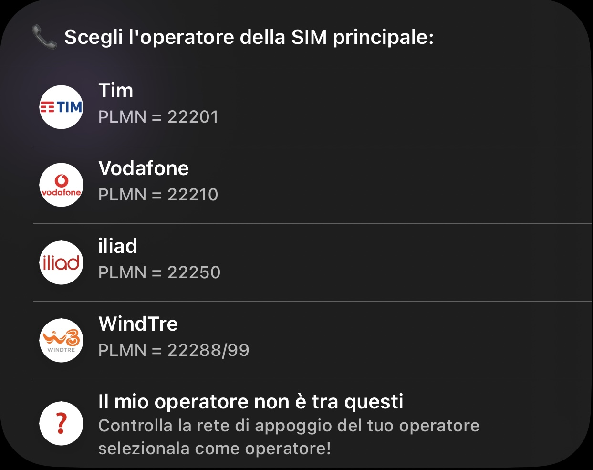
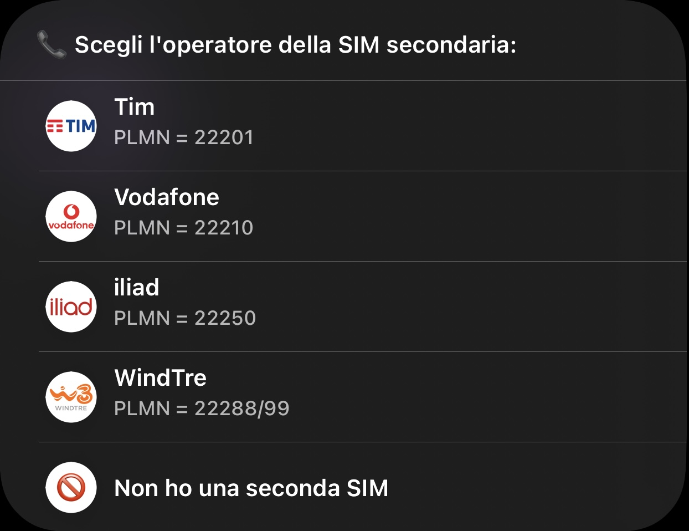

# ShorteNB 

**Join the [Telegram group](https://t.me/ShorteNB)!**

A shortcut by @andreag00 on [Telegram](https://t.me/andreag00)/ag23900 on [Fibra Click](https://forum.fibra.click/u/ag23900)

Big thanks to [Abdel](https://github.com/ADeltaX) and [Simone](https://github.com/SimoneBortolin) for help with the Shortcut's JavaScript code, MarcoGiaco for creating all the logos in the appropriate dimensions.

## Versione Italiana
Decodifica facilmente i dati dal CellID che si trova nel FieldTest di Apple (FTMInternal-4) mostrando anche dati sulla BTS a cui si è connessi presi da LTE Italy. **Supporta solo MNO italiani**


Lo shortcut va eseguito dopo aver copiato il CellID dal FieldTest e decodifica eNB, CID e banda (se disponibile) dal CellID. 
Oltre a decodificare questi dati, all'utente viene presentato un prompt per aprire velocemente la pagina di LTE Italy contenente tutte le informazioni sulla BTS o, in alternativa, per aprire la mappa di LTE Italy centrata sulla posizione GPS dell'utente. 
Inoltre, nella notifica vengono mostrati dei dati aggiuntivi sulla BTS a cui l'utente è collegato, quali nome, bande attive (sia in 4G che in 5G) e le caratteristiche del 5G attivo sull'eNB in questione.

L'ideale è usarlo in concomitanza con [questo shortcut](https://github.com/Andreag00/FTM-Opener), che apre il FieldTest **se aggiunto alla Home Screen**.

### Come importare in Shortcuts

#### Prerequisiti

**Perché ShorteNB funzioni è necessario installare [Scriptable](https://apps.apple.com/it/app/scriptable/id1405459188).**

Per importare lo shortcut è sufficiente scaricare e aprire il [file .shortcut](ShorteNB.shortcut), oppure aprire il link iCloud presente nel [file "link"](link).

### Come effettuare il primo setup di ShorteNB

In concomitanza alla prima esecuzione dello shortcut, ShorteNB richiede l'impostazione di alcuni valori per funzionare correttamente.

Innanzitutto, ShorteNB chiede se Scriptable è stata installata, in quanto è un'app essenziale perché lo shortcut possa funzionare:


Se l'app non è ancora stata installata, si apre la pagina dell'App Store per installarla, lasciando ShorteNB in esecuzione in background. Una volta terminata l'installazione e dopo essere tornati sull'app Shortcuts, proseguirà il setup. 

Dopo il primo passo, si aprirà automaticamente Scriptable, che presenterà un prompt per inserire username e password di LTE Italy al fine di effettuare il login, poichè le loro API richiedono autenticazione:


**DISCLAIMER: Le credenziali vengono salvate all'interno del Keychain di Scriptable e lasciano il dispositivo solo per effettuare il login su LTE Italy, a cui vengono inviate in modo sicuro. Lo sviluppatore declina ogni responsabilità in caso di compromissione di dati personali.**

Il prompt successivo richiede di indicare l'operatore della SIM principale dell'utente:



In maniera simile alla richiesta precedente, l'utente deve ora indicare l'operatore della propria SIM secondaria, se presente:


 
**WARNING:** La combinazione di operatori Tim+WindTre non è supportata in quanto entrambi usano eNB a 6 cifre e lo shortcut non può distinguere tra i due operatori. 
Questa incompatibilità si riflette sul menu della scelta dell'operatore della SIM secondaria, che non permette di selezionare tale combinazione.

Dopo il primo setup, anche in caso di aggiornamento, non ci sarà bisogno di effettuare nuovamente il setup, in quanto vengono salvate all'interno del Keychain di Scriptable.

Per poter effettuare nuovamente il setup, è necessario eseguire il seguente comando all'interno di Scriptable:

```
Keychain.set("setup","false") # Forza un nuovo primo setup di ShorteNB
```

In alternativa è possibile modificare singolarmente le impostazioni di ShorteNB coi seguenti comandi:

```
Keychain.set("username"."abc123") # Inserire il proprio username al posto di abc123
Keychain.set("password"."abc123") # Inserire la propria password al posto di abc123
Keychain.set("MNC1"."222xx") # Inserire il Mobile Network Code (MNC) della SIM principale al posto di xx
Keychain.set("MNC2"."222yy") # Inserire il Mobile Network Code (MNC) della SIM secondaria al posto di yy
Keychain.remove("cookie") # Elimina i cookie che vengono salvati per forzare un nuovo login
```

## English Version
Easily decode data out of the CellID found in Apple's FTMInternal-4 together with extra data gathered from LTE Italy'APIs. **Italian MNOs only**


Provided with the CellID as input from the clipboard, the shortcut decodes data out of it showing it in an alert together with extra data gathered from [LTE Italy](https://lteitaly.it)'s APIs. 
It also makes it easy to open [LTE Italy](https://lteitaly.it)'s map or the BTS’s info page.

Works great in conjunction with [this shortcut](https://github.com/Andreag00/FTM-Opener), as it opens FTMInternal-4, but only when ran from the Home Screen.

### How to import into Shortcuts

#### Prerequisites

**For ShorteNB to work, [Scriptable](https://apps.apple.com/it/app/scriptable/id1405459188?l=en) is required.**

To import the shortcut, simply download the [.shortcut file](ShorteNB.shortcut) or open the link in the ["link" file](link).

### How to setup the shortcut

When executed for the very first time, the shortcut will prompt the user to input some data required for it to work properly.

First of all, ShorteNB will ask if Scriptable has been installed, as it's a required app for the shortcut to work at all:


If the user has not yet installed the app, the Shortcut will automatically open Scriptable's App Store page so that the user can install it and leave ShorteNB running in the background. Once the app has been installed the user shall return to Shortcuts to finish the setup.

After this is done, Scriptable will open to present a prompt to insert the user's LTE Italy credentials, to be able to use their APIs which require authentication:


**DISCLAIMER: Credentials are stored in Scriptable's Keychain and leave the device only to login into LTE Italy in a secure way. The developer declines any responsibility in case of any violation of private data.**

The next prompt asks the user to choose their main SIM's operator:


The fifth prompt, similarly to the previous one, is used to choose the user's secondary SIM's operator, if present:


**WARNING:** As having Tim and WindTre as operators is not supported (because both user 6-number eNBs and there is no way to distinguish them), if either of them is chosen as the main SIM's operator, the prompt for the secondary SIM will not allow the user to choose the other one.

After the first setup is done, there's never gonna be any need to go through it again, as all settings, just like the user's credentials, are saved in Scriptable's Keychain. This means that they persist even through any update to the Shortcut.

If the user ever needs to go through the first setup again, it can do so by launching the following command in Scriptable:

```
Keychain.set("setup","false") # Forces a new execution of ShorteNB's first setup
```

Alternatively, if the user wants to change settings granularly, it can do so by running the following commands:

```
Keychain.set("username"."abc123") # Insert the username in place of abc123
Keychain.set("password"."abc123") # Insert the password in place of abc123
Keychain.set("MNC1"."222xx") # Insert the main SIM's Mobile Network Code (MNC) in place of xx
Keychain.set("MNC2"."222yy") # Insert the secondary SIM's Mobile Network Code (MNC) in place of yy
Keychain.remove("cookie") # Resets the saved cookies to forse a new login
```
